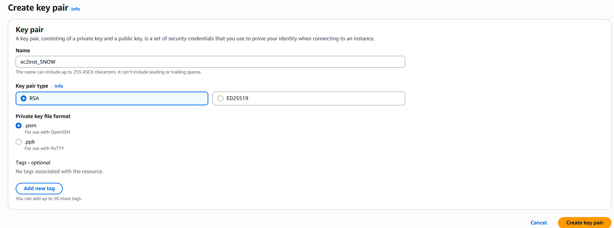
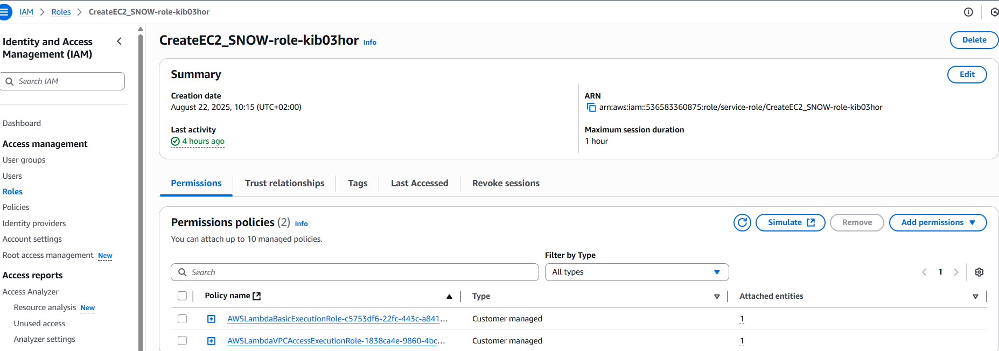
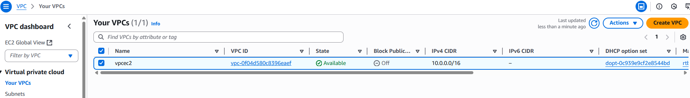
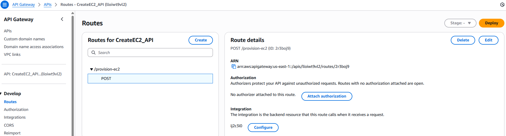
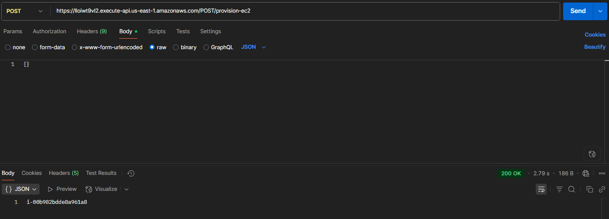
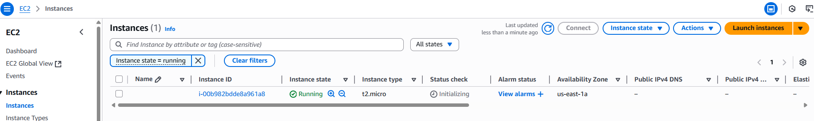

# 🚀 Provisioning EC2 Instances using AWS Lambda + API Gateway

The project demonstrates provisioning of AWS EC2 using a serverless architecture using:
- AWS Lambda - which is a serverless service that allows users to run code without managing servers. Once run, AWS handles the underlying infrastructure, including server provisioning, patching and maintainence.
- API Gateway - which allows us to create, publish, monitor and secure APIs. Here, HTTP API is used to send request to AWS Lambda.
- Boto3 - which is a Python module that allows us to interact with AWS and has the ability to perform operations such as creating and managing EC2 instances, S3 buckets, Lambda functions, etc.
  
## 📌 Objective

To  build a serverless API endpoint that provisions a new EC2 instance when a POST request is made. 

## Tools and Services 
- AWS Lambda
- AWS API Gateway
- AWS IAM
- AWS EC2
- Postman
- Python 3 (boto3)

## :white_check_mark: Steps 
### Step 1: Create Ec2 Key Pair
- Go to EC2 -> Key pairs -> Create key pair
- Give a name (For eg: **ec2inst_SNOW**), select key pair type as **RSA**
- Select **.pem ** for private key format and create



### Step 2: Create the Lambda Function
- Go to Lambda -> Create Function -> Author from scratch -> Enter function name (**CreateEC2_SNOW**)
- Runtime - Python 3.xx
- Default execution role  -> Create a new role with basic Lambda permissions

### Step 3: Modify IAM Role for Lambda
- Go to IAM > Roles
- Find the role created with Lambda (e.g., `CreateEC2_SNOW-role-xxxx`)
  


- Go to Permissions policies -> Edit the inline policy and replace with:
  
```json
  {
    "Version": "2012-10-17",
    "Statement": [
        {
            "Effect": "Allow",
            "Action": [
                "logs:CreateLogGroup",
                "logs:CreateLogStream",
                "logs:PutLogEvents"
            ],
            "Resource": "arn:aws:logs:*:*:*"
        },
        {
            "Effect": "Allow",
            "Action": [
                "ec2:RunInstances"
            ],
            "Resource": "*"
        }
    ]
}

```
### Step 4: Create VPC and Subnet
- Go to VPC -> Create VPC
- IPv4 CIDR - 10.0.0.0/16
- Subnet - IPv4 CIDR - 10.0.0.0/24
- AZ - use1-az1 (us-east-1a)




  
### Step 5: Add Lambda Function Code
- Upload or paste this code in the Lambda function editor:

```python
import boto3

AMI = 'ami-00ca32bbc84273381' # Take the latest from EC2 -> Images-> AMIs
INSTANCE_TYPE = 't2.micro'
KEY_NAME = 'ec2inst_SNOW' # Enter Key pair created
REGION = 'us-east-1'
SUBNET_ID = 'subnet-0c641febbc4766444'  #  Replace with your actual subnet ID
SECURITY_GROUP_ID = 'sg-0b746e5d687f3f769' # From VPC you get sec group

ec2 = boto3.client('ec2', region_name=REGION)


def lambda_handler(event, context):

    instance = ec2.run_instances(
        ImageId=AMI,
        InstanceType=INSTANCE_TYPE,
        KeyName=KEY_NAME,
        SubnetId=SUBNET_ID,
        SecurityGroupIds=[SECURITY_GROUP_ID],
        MaxCount=1,
        MinCount=1
    )
    
    print ("New instance created:")
    instance_id = instance['Instances'][0]['InstanceId']
    print (instance_id)

    return instance_id
```
### Step 6: Create API Gateway HTTP API
- Go to API Gateway > HTTP APIs > Create API
- Add integration → Lambda → Select **CreateEC2_SNOW**
- Create route -> POST /provision-ec2
- Enable CORS
- Deploy the API (or enable automatic deployment) → Name the stage (e.g., prod or POST or anything)
- Stages -> Copy the Invoke URL (eg: `https://lloiwt9vl2.execute-api.us-east-1.amazonaws.com/POST/provision-ec2`)

### Step 7: Test with Postman
- Open Postman -> method - POST
- URL -> `https://lloiwt9vl2.execute-api.us-east-1.amazonaws.com/POST/provision-ec2`
- Body -> Raw -> JSON -> enter `{}`
- Click Send
- As a result you can see the EC2 instance created and its Instance ID (`i-00b982bdde8a961a8`)



Thus, A new EC2 instance is launched with the specified parameters every time a valid POST request is made. YOu can also verify by checking in the AWS account under EC2.


